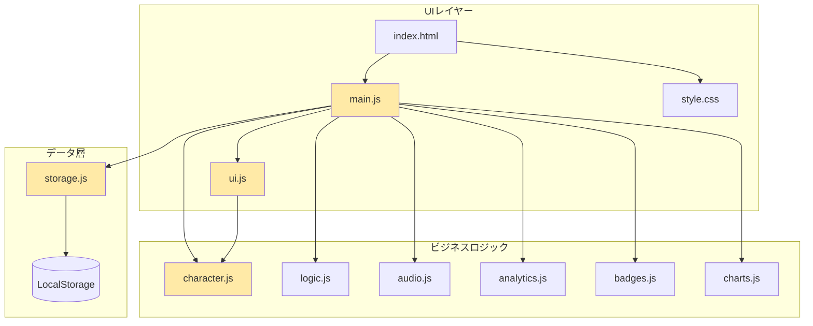
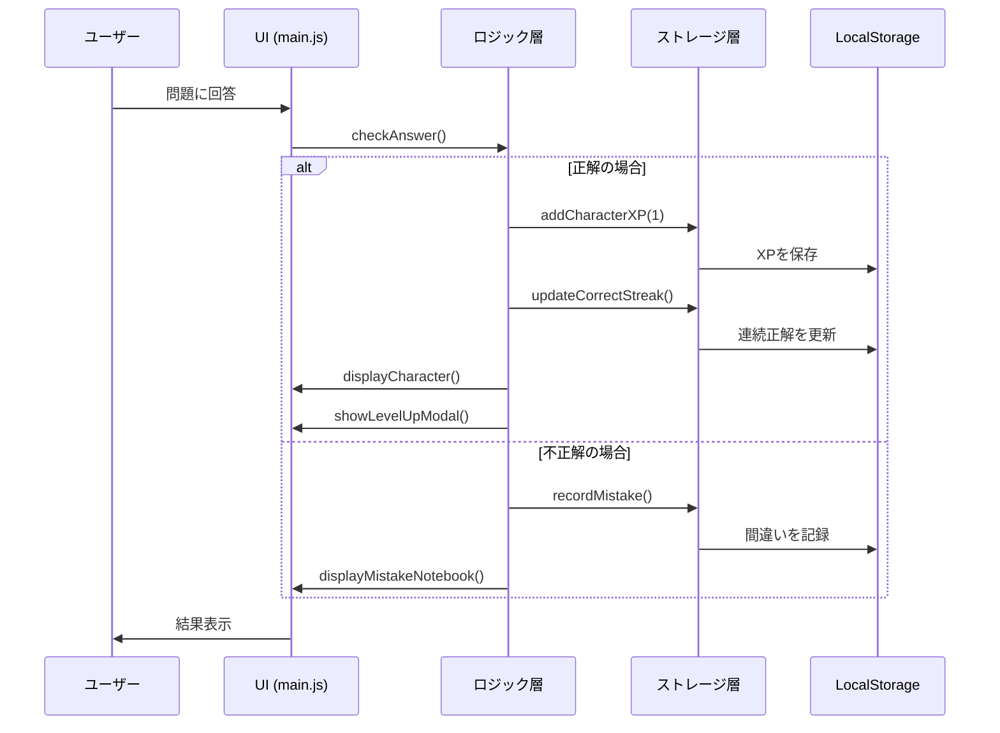
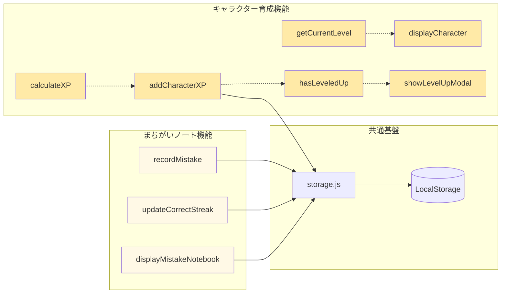

# 進捗レポート: 子供向け機能追加プロジェクト

## 概要

Gemini CLIを活用して子供が喜ぶ機能を10案生成し、優先度評価を経て上位3つの機能を選定しました。現在、そのうち2つの機能を実装完了しています。

## 実装完了機能

### 1. まちがいノート機能 (PR #7)

**ビジネス価値**: ⭐⭐⭐⭐⭐
**実装難易度**: 低
**リスク**: 低

間違えた問題を自動的に記録し、3回連続正解すると「卒業」できる仕組みです。

**主な実装内容**:
- LocalStorageによる間違い履歴の永続化
- 連続正解カウンター機能
- カード型UIでの視覚的な表示
- ホバーアニメーション

**技術スタック**:
- Vanilla JavaScript
- LocalStorage API
- CSS Grid Layout
- CSS Transitions

### 2. キャラクター育成システム (PR #8)

**ビジネス価値**: ⭐⭐⭐⭐
**実装難易度**: 中
**リスク**: 低

正解するとXPが貯まり、キャラクターが5段階で成長するシステムです。

**主な実装内容**:
- 5段階のレベルシステム(たまご→あかちゃん→こども→おとな→マスター)
- XPによる経験値管理
- レベルアップ時のモーダル演出
- プログレスバーによる進捗表示

**技術スタック**:
- Vanilla JavaScript
- LocalStorage API
- CSS Animations (@keyframes)
- CSS Gradient Backgrounds

## システムアーキテクチャ

### モジュール構成図

### データフロー図

### 機能間の依存関係

## 実装統計

### コード追加量

| ファイル | 追加行数 | 機能 |
|:---------|:---------|:-----|
| js/character.js | 114行 | キャラクター育成 |
| js/storage.js | 95行 | データ永続化 |
| js/ui.js | 171行 | UI表示 |
| js/main.js | 36行 | 統合ロジック |
| index.html | 8行 | HTML構造 |
| style.css | 200行 | スタイリング |
| **合計** | **624行** | |

### LocalStorageキー

| キー名 | 格納データ | 使用機能 |
|:-------|:-----------|:---------|
| `mistakes` | 間違い履歴の配列 | まちがいノート |
| `characterXP` | 経験値(整数) | キャラクター育成 |

## 次のステップ

### Phase 8: 3つ目の機能実装

**対象機能**: ごほうびカレンダー (優先度3位)

**計画概要**:
- 毎日のログイン記録
- 連続ログイン日数の表示
- カレンダーUIでのスタンプ表示
- ストリークボーナス

**技術検討事項**:
- Date APIによる日付管理
- CSS Gridによるカレンダーレイアウト
- タイムゾーン考慮

## まとめ

Gemini CLIを活用したアイデア生成と優先度評価により、効率的に子供向け機能を実装できました。2つの機能は独立性が高く、相互に干渉せず動作しています。引き続き3つ目の機能実装に進みます。
